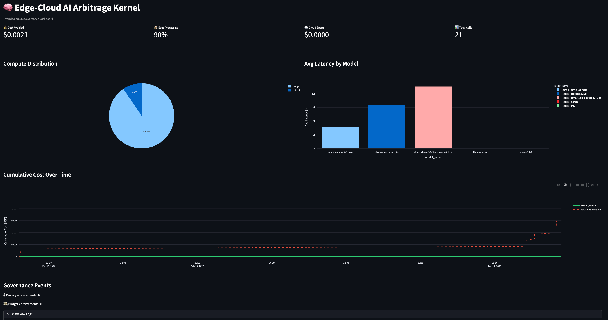

# 🧠 Edge-Cloud AI Arbitrage Kernel

**A Deterministic Governance Engine for Cost-Aware, Privacy-Safe LLM Workload Routing**

[](https://www.python.org/downloads/)
[](LICENSE)
[](https://ollama.com/)
[](https://ai.google.dev/)

______________________________________________________________________

## 📋 Table of Contents

- [What Is This?](#-what-is-this)
- [Why Does This Exist?](#-why-does-this-exist)
- [The Core Innovation: A Democratic Council](#-the-core-innovation-a-democratic-council)
- [Key Features](#-key-features)
- [Architecture](#-architecture)
- [Model Inventory](#-model-inventory)
- [Quick Start](#-quick-start)
- [Usage Guide](#-usage-guide)
- [Project Structure](#-project-structure)
- [How Routing Decisions Work](#-how-routing-decisions-work)
- [Cost Model & ROI](#-cost-model--roi)
- [Testing & Validation](#-testing--validation)
- [Executive Dashboard](#-executive-dashboard)
- [Tech Stack](#-tech-stack)
- [Design Principles](#-design-principles)
- [Roadmap](#-roadmap)
- [The 60-Second Explanation](#-the-60-second-explanation)
- [License](#-license)
- [Author](#-author)

______________________________________________________________________

## 🎯 What Is This?

A Python-based hybrid AI orchestration engine where **five independent local language models form a democratic council**. For every prompt, this council decides whether to answer locally at zero marginal cost or escalate to a paid cloud LLM.

When the council stays local, the models deliberate on **which model should answer**, generate a response, and then **iteratively review each other’s work** until consensus is reached or a maximum number of iterations is hit.

> This is a governance layer for AI compute allocation and privacy, not “just another chatbot”.

Every routing decision, vote, review, and answer is logged to SQLite with full audit trails. Sensitive data never leaves the device. Cloud spending is bounded by soft and hard budget limits.

______________________________________________________________________

## 🤔 Why Does This Exist?

Most AI workloads go straight to the cloud. That leads to:

| Problem   | Impact                                             |
| --------- | -------------------------------------------------- |
| Expensive | Cloud API costs scale linearly with usage          |
| Slow      | Network round-trips add significant latency        |
| Risky     | Sensitive data leaves your control and your device |

The Arbitrage Kernel asks, for every request:

> “Do five independent models agree this task **needs** the cloud, or can local hardware handle it?”

By making that a **collective decision** rather than a static rule, the system targets:

- 60–70% of workloads routed to **local inference at zero marginal cost**
- Privacy policies enforced in code, not in prompts
- Budget governance with automatic downgrade / cut‑off
- Full observability of decisions and model behavior

______________________________________________________________________

## 🏛️ The Core Innovation: A Democratic Council

For each prompt, the council runs four phases:

```text
USER PROMPT
    |
    v
PHASE 1: ROUTING VOTE
  All 5 models vote:
    "Local (free) or Cloud (paid)?"

    |
    v
PHASE 2: MODEL SELECTION (if local)
  Models vote on which one should answer
  (confidence‑weighted plurality)

    |
    v
PHASE 3: ANSWER GENERATION
  Selected model produces an answer

    |
    v
PHASE 4: ITERATIVE REVIEW
  All models review, approve/reject, provide feedback
  Up to 3 iterations until consensus or max rounds

    |
    v
FINAL ANSWER
Privacy override: If data_sensitivity == HIGH, routing is forced to local and the routing vote is skipped entirely. Models never get to vote on whether sensitive data leaves the device.
```

## ✨ Key Features

| Feature                 | Description                                                                                                  |
| ----------------------- | ------------------------------------------------------------------------------------------------------------ |
| Democratic council      | 5 local LLMs vote on routing, model selection, and answer quality, weighted by confidence.                   |
| Iterative peer review   | Models review the answer, provide feedback, and the answering model improves up to 3 rounds.                 |
| Privacy gating          | HIGH sensitivity tasks bypass routing and are forced local.                                                  |
| Budget governance       | Soft and hard budget caps; when exceeded, routing is automatically constrained to local.                     |
| Full observability      | All calls, votes, reviews, and decisions logged to SQLite with reasoning and confidence scores.              |
| Cloud fallback handling | If a voted cloud model is unavailable, the system gracefully falls back to local instead of failing.         |
| Multi‑agent research    | Optional Explainer → Skeptic → Synthesizer pipeline that produces structured JSON with risks, consensus.     |
| Executive dashboard     | Streamlit dashboard for cost avoidance, compute distribution, latency, governance events, and council stats. |

## 🏗️ Architecture

### System Overview

```text
User Prompt
    |
    v
Task Metadata (type, complexity, sensitivity, importance)
    |
    v
Privacy Pre‑Check
    - If HIGH sensitivity -> force LOCAL, skip routing vote
    - Else -> proceed to council

    |
    v
COUNCIL DELIBERATION ENGINE (council/deliberation.py)
  Phase 1: Routing Vote      -> "local" or "cloud" (plus suggested cloud tier)
  Phase 2: Model Selection   -> choose best local model
  Phase 3: Answer Generation -> selected model answers
  Phase 4: Iterative Review  -> approve / refine up to N rounds

    |
    +-------------------+---------------------+
    |                                       |
    v                                       v
EDGE TIER (Ollama)                     CLOUD TIER (Gemini API)

    |
    v
Logging Layer (SQLite)
  - call_logs
  - council_deliberations

    |
    v
Executive Dashboard (Streamlit)
  - cost, latency, routing patterns, governance events
```

### Routing Decision Hierarchy

Routing decisions are evaluated in strict order; the first match wins:

```text
Start
  |
  v
Is data_sensitivity == HIGH?
  |-- YES --> Force LOCAL (skip council)
  |
  v
Is privacy mode == "edge_only"?
  |-- YES --> Force LOCAL
  |
  v
Has hard budget been exceeded?
  |-- YES --> Force LOCAL
  |
  v
Has soft budget been exceeded?
  |-- YES --> Prefer LOCAL, downgrade cloud tier
  |
  v
Run council routing vote (5 models)
  |
  v
Compare confidence‑weighted scores:
  - If local_score >= cloud_score -> LOCAL PATH
  - Else -> CLOUD PATH (using voted tier)
```

## 📦 Model Inventory

### Edge Models (Local via Ollama)

| Model               | ID                      | Params | Notes                                      |
| ------------------- | ----------------------- | ------ | ------------------------------------------ |
| Llama 3.1 8B        | `ollama/llama3.1-8b`    | 8B     | Strong instruction following, good default |
| DeepSeek R1 8B      | `ollama/deepseek-r1-8b` | 8B     | Excellent reasoning / analytical tasks     |
| Qwen 3 8B           | `ollama/qwen3-8b`       | 8B     | Fast, multilingual, general knowledge      |
| DeepSeek Coder 6.7B | `ollama/deepseek-coder` | 6.7B   | Specialized for code tasks                 |
| GPT‑OSS 20B (opt.)  | `ollama/gpt-oss-20b`    | 20B    | Strongest local model, heavy on RAM        |

### Cloud Models (Google Gemini API)

| Model                  | ID                       | Tier     | Best For                              |
| ---------------------- | ------------------------ | -------- | ------------------------------------- |
| Gemini 2.5 Flash Lite  | `gemini-2.5-flash-lite`  | Economy  | High‑volume, cost‑sensitive workloads |
| Gemini 2.5 Flash       | `gemini-2.5-flash`       | Standard | General‑purpose, fast responses       |
| Gemini 2.5 Pro         | `gemini-2.5-pro`         | Premium  | Complex reasoning and research        |
| Gemini 3.0 Pro Preview | `gemini-3.0-pro-preview` | Frontier | Frontier‑tier experiments             |

## 🚀 Quick Start

### Prerequisites

- macOS with Apple Silicon (developed on M1 Pro 16 GB)
- Python 3.14+
- Ollama installed and running
- Google Gemini API key (free tier available via Google AI Studio)

1. Clone the repository

```bash
git clone https://github.com/im-AbhiP/edge-cloud-arbitrage-kernel.git
cd edge-cloud-arbitrage-kernel
```

### 2. Set Up the Python Environment

```bash
python3 -m venv .venv
source .venv/bin/activate
```

Install runtime dependencies

```bash
pip install -r requirements.txt
```

For development (testing, linting, formatting)

```bash
pip install -r requirements-dev.txt pre-commit install
```

3. Install and start Ollama

```bash
brew install ollama
ollama serve
```

In a new terminal tab, pull the models:

```bash
ollama pull llama3.1:8b-instruct-q5_K_M
ollama pull deepseek-r1:8b
ollama pull qwen3:8b
ollama pull deepseek-coder:6.7b
# optional heavy model
ollama pull gpt-oss:20b
```

4. Configure environment variables
   Create a .env in the project root:

```text
GEMINI_API_KEY=your_gemini_api_key_here
PRIVACY_MODE=hybrid
SOFT_BUDGET_USD=1.00
HARD_BUDGET_USD=5.00
Get a Gemini key from Google AI Studio.
```

5. Run the smoke test

```bash
python test_smoke.py
```

You should see the council run through three scenarios (simple question, complex research, sensitive data) with routing decisions printed in the console.

6. Run contract tests

```bash
pytest council/contract_tests.py -v
```

7. Launch the interactive CLI

```bash
python main.py
```

8. Launch the dashboard

```bash
streamlit run dashboard/streamlit_app.py
```

## 💻 Usage Guide

### Interactive CLI

```bash
python main.py                     # default settings
python main.py --fast              # fewer, smaller models for speed
python main.py --include-large     # include heavy gpt-oss:20b
python main.py --models 3          # use only 3 council models
python main.py --iterations 2      # max 2 review rounds
python main.py --majority          # majority approval instead of unanimous
```

Inside the session you can:

```text
What is the capital of France?
/research Analyze AMD MI300X vs NVIDIA H100
/code Review this function: def add(a, b): return a + b
/private Analyze this salary data: John earns $150k
stats
help
quit
```

### Prefix hints:

| Prefix      | Effect                                    |
| ----------- | ----------------------------------------- |
| `/research` | Deep research / analysis                  |
| `/code`     | Code review / generation                  |
| `/summary`  | Summarization                             |
| `/planning` | Planning / strategy tasks                 |
| `/creative` | Creative writing                          |
| `/data`     | Data analysis                             |
| `/private`  | Force local processing (HIGH sensitivity) |

### Programmatic API (example)

```python
from council.agents import LLMCouncil
from runtime.tasks import TaskType, DataSensitivity

council = LLMCouncil(
    council_models=[
        "ollama/llama3.1-8b",
        "ollama/deepseek-r1-8b",
        "ollama/qwen3-8b",
    ],
    max_iterations=3,
    approval_threshold=0.67,
)

result = council.ask(
    "What is the difference between TCP and UDP?",
    task_type=TaskType.QUICK_QA,
    complexity=0.2,
)

print(result.final_answer)
print(result.routing_decision)
print(result.selected_model)
print(result.consensus_reached)
```

### Privacy‑enforced task:

```python
result = council.ask(
    "Analyze this employee's compensation: $145,000 base + $30,000 bonus",
    task_type=TaskType.DATA_ANALYSIS,
    data_sensitivity=DataSensitivity.HIGH,
)

assert result.routing_decision == "local"
assert result.routing_votes == []
```

## 📁 Project Structure

```text
edge-cloud-arbitrage-kernel/
|
|-- runtime/                            # Core inference engine
|   |-- __init__.py
|   |-- models.py                       # Model clients, profiles, registry
|   |-- tasks.py                        # TaskMetadata, TaskType, DataSensitivity
|   |-- router.py                       # Council-based and rule-based routing
|   |-- prompts.py                      # Prompt registry loader
|   |-- prompts.yaml                    # Prompt templates with expected tokens
|   |-- logging_utils.py               # SQLite logging, cost estimation, ROI stats
|   +-- policies.py                     # Policy configuration
|
|-- council/                            # Council of Local LLMs
|   |-- __init__.py
|   |-- deliberation.py                 # 4-phase deliberation engine (core)
|   |-- agents.py                       # LLMCouncil high-level interface
|   |-- prompts.py                      # System prompts for voting and review
|   |-- schemas.py                      # JSON schemas for votes and reviews
|   +-- contract_tests.py              # 27 pytest contract tests
|
|-- benchmarking/                       # Empirical evaluation framework
|   |-- __init__.py
|   |-- run_benchmarks.py              # Benchmark runner (tasks x models)
|   |-- benchmark_dataset.yaml         # 8 benchmark scenarios
|   +-- reports/                        # Auto-generated CSV + Markdown reports
|
|-- dashboard/
|   +-- streamlit_app.py              # Executive dashboard (8 sections)
|
|-- scripts/
|   +-- summarize_logs.py             # CLI ROI report generator
|
|-- analysis/
|   +-- analyze_logs.py               # Ad-hoc log analysis utilities
|
|-- data/
|   +-- logs.db                        # SQLite database (auto-created, gitignored)
|
|-- reports/                            # Generated ROI summaries
|
|-- main.py                             # Interactive CLI entry point
|-- test_smoke.py                       # End-to-end smoke test (3 scenarios)
|-- requirements.txt                    # Runtime dependencies (8 packages)
|-- requirements-dev.txt                # Dev dependencies (testing, linting, formatting)
|-- requirements-lock.txt               # Full pip freeze snapshot (optional)
|-- .pre-commit-config.yaml            # mdformat hook configuration
|-- .env                                # API keys and config (gitignored)
|-- .gitignore
|-- LICENSE
+-- README.md
```

## 🔍 How Routing Decisions Work

Every routing decision is logged with both the final outcome and the individual votes that led to it.

### Examples

| Scenario                    | Expected Behavior                                     |
| --------------------------- | ----------------------------------------------------- |
| Simple factual question     | Council votes LOCAL unanimously                       |
| Complex multi‑step analysis | Council may vote CLOUD (premium tier)                 |
| Code review task            | Council votes LOCAL, choosing a code‑specialist model |
| Reasoning‑heavy task        | Council prefers a reasoning‑focused local model       |
| HIGH sensitivity data       | Routing vote skipped, forced LOCAL                    |
| Budget exceeded             | Rules override council, force LOCAL                   |
| Cloud API failure           | Automatic fallback to LOCAL                           |

### Example log (truncated):

```text
============================================================
COUNCIL DELIBERATION [a3f2b1c9]
Prompt: What is the capital of France?
============================================================

--- PHASE 1: Routing Vote (local vs. cloud) ---
[routing_vote] Asking ollama/llama3.1-8b... OK vote=local conf=0.95
[routing_vote] Asking ollama/deepseek-r1-8b... OK vote=local conf=0.90
[routing_vote] Asking ollama/qwen3-8b... OK vote=local conf=0.92

[TALLY] Local: 3, Cloud: 0 -> Decision: LOCAL

--- PHASE 2: Model Selection Vote ---
[model_selection] ... vote=ollama/qwen3-8b conf=0.80
...

[SELECTED] ollama/qwen3-8b will generate the answer

--- PHASE 3: Generating Answer ---
[GENERATE] ollama/qwen3-8b is answering...
[GENERATE] Answer received

--- PHASE 4: Review Iteration 1/2 ---
[review iter 1] ... APPROVED score=0.92
...

[CONSENSUS] All council members approve!
============================================================
DELIBERATION COMPLETE [a3f2b1c9]
Decision: LOCAL -> ollama/qwen3-8b
Iterations: 1
Consensus: YES
💰 Cost Model & ROI
Pricing (illustrative)
Model	Tier	Input / Output Pricing (per 1M tokens)
All Ollama edge models	Edge	$0.00 / $0.00
Gemini 2.5 Flash Lite	Cloud (Economy)	$0.075 / $0.30
Gemini 2.5 Flash	Cloud (Standard)	$0.15 / $0.60
Gemini 2.5 Pro	Cloud (Premium)	$1.25 / $5.00
Gemini 3.0 Pro Preview	Cloud (Frontier)	$2.50 / $10.00
For each edge call, the system also calculates the hypothetical cloud cost (e.g., if routed to Flash) and logs cost‑avoidance.
```

Sample ROI summary (from scripts/summarize_logs.py):

```text
Edge-Cloud AI Arbitrage Kernel — ROI Report

Executive Summary
-----------------
Total AI calls: 46
Edge (local) calls: 31 (67.4%)
Cloud calls: 15 (32.6%)

Total cloud cost: $0.0123
Cost if ALL calls were cloud: $0.0970
💰 Cost avoided: $0.0847

Average latency: 1,847 ms
Success rate: 97.8%
```

## 🧪 Testing & Validation

### Contract Tests

```bash
pytest council/contract_tests.py -v
```

Categories covered:

- Deliberation structure and types
- Iteration and consensus behavior
- Timing bounds
- Vote and review schema correctness
- Privacy enforcement (HIGH sensitivity always local)
- Cloud path behavior
- Local path behavior

### Smoke Test

```bash
python test_smoke.py
```

Covers:

- Simple Q&A routed locally
- Complex research possibly routed to cloud
- HIGH sensitivity data forced to local regardless of other factors

## 📊 Executive Dashboard

The Streamlit dashboard (in dashboard/streamlit_app.py) provides:

- Cost Avoidance – cost avoided vs full‑cloud baseline, edge %, cloud spend
- Compute Overview – edge/cloud share, latency by model
- Cost Over Time – cumulative actual cost vs hypothetical full‑cloud cost
- Governance Events – privacy and budget enforcement counts
- Per‑Model Breakdown – calls, latency, tokens, cost, success rate, tokens/sec
- Inference Performance – prefill vs decode speed, load times, throughput
- Council Stats – routing vote distribution, selection popularity, consensus rate, iterations
- Raw Logs – direct views on call_logs and council_deliberations

Launch:

```bash
streamlit run dashboard/streamlit_app.py
```

Dashboard screenshot:


## 🛠️ Tech Stack

| Component       | Technology         | Why                                        |
| --------------- | ------------------ | ------------------------------------------ |
| Language        | Python 3.11+       | Mature ecosystem, batteries‑included       |
| Local inference | Ollama             | Best‑in‑class for Apple Silicon            |
| Cloud inference | Google Gemini API  | Strong quality and free tier               |
| Data store      | SQLite             | Zero config, easy to ship, SQL‑friendly    |
| Config          | YAML + `.env`      | Human‑readable, environment‑aware          |
| HTTP client     | httpx              | Modern async client, no heavy SDK required |
| Testing         | pytest             | Standard, expressive test framework        |
| Linting         | Ruff               | Fast, modern linting                       |
| Dashboard       | Streamlit + Plotly | Rapid interactive analytics                |

## 🎯 Design Principles

| Principle                 | Description                                                          |
| ------------------------- | -------------------------------------------------------------------- |
| Democracy over diktat     | Multiple models vote instead of a single authority.                  |
| Explicit over magic       | Routing rules are readable; every decision is logged with reasoning. |
| Measure everything        | If it isn’t logged, it didn’t happen.                                |
| Privacy is non‑negotiable | HIGH sensitivity data never leaves the device, enforced in code.     |
| Iterate to quality        | First drafts are reviewed and improved, not accepted blindly.        |
| Graceful degradation      | Failures fall back to safe defaults, not crashes.                    |
| Ship, then improve        | v1 is explicit and sequential; v2 can add parallelism and learning.  |

## 🗺️ Roadmap

### v1 (Current)

- ✅ Local council over multiple Ollama models
- ✅ Cloud integration via Gemini (multiple tiers)
- ✅ Four‑phase deliberation with iterative review
- ✅ Privacy and budget enforcement
- ✅ SQLite logging and ROI reporting
- ✅ Executive Streamlit dashboard
- ✅ Contract tests and smoke tests

### v2 (Planned)

- Performance‑adaptive routing based on historical logs
- Task decomposition (local chunking, cloud synthesis)
- Confidence‑based escalation to stronger models
- Parallel council execution on higher‑RAM systems
- Integration with additional model providers (e.g., OpenRouter)

## ⏱️ The 60-Second Explanation

I built a hybrid AI orchestration engine where multiple local language models form a democratic council. For each prompt, they collectively vote on whether to answer locally at zero cost or escalate to a cloud model like Gemini. When they stay local, they also vote on which model should answer based on the task type and complexity. The selected model generates an answer, and then the whole council reviews it, providing targeted feedback. The answering model improves its answer until they reach consensus or hit a max iteration limit. Sensitive data never gets a vote: it is forced to remain on device by a hard privacy rule. The system is optimized for Apple Silicon, routes most workloads to local inference while maintaining quality, logs everything to SQLite, and exposes an executive dashboard for cost avoidance, latency, and governance events.

📄 License
This project is licensed under the MIT License — see the LICENSE file for details.

👤 Author
Abhishek Patil\
Senior Technical Product Manager @ AMD\
Building at the intersection of AI infrastructure, edge compute, and hybrid cloud governance.\
[](https://linkedin.com/in/abhishekhpatil) [](https://github.com/im-AbhiP)
